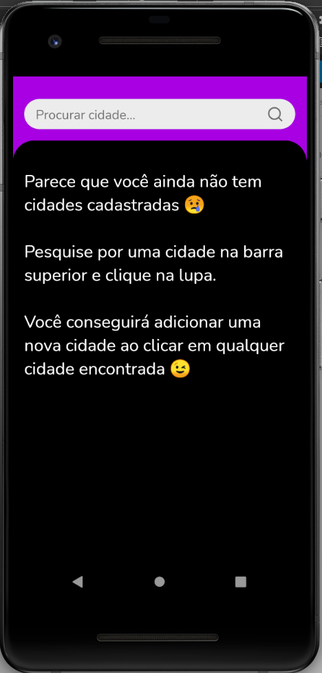
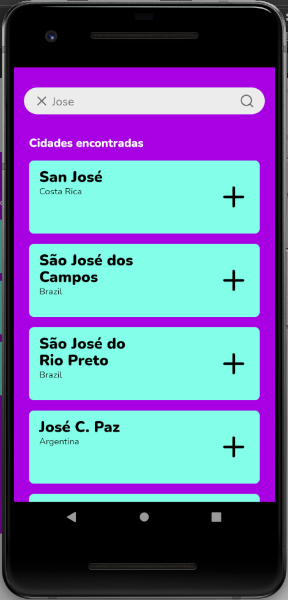
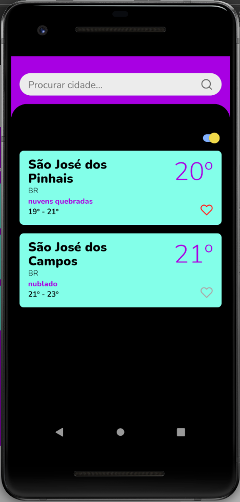
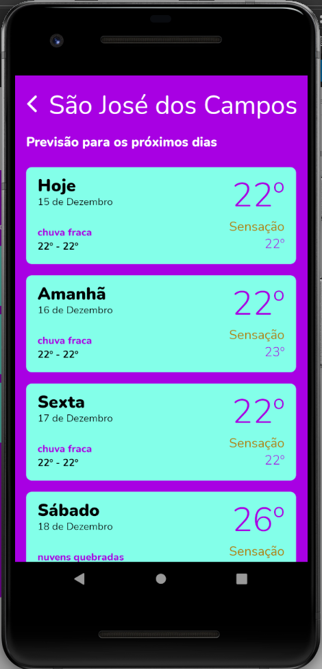

# Weather App

Do you wanna know the weather? **_Check this out_**!

## About the app

This app idea was concieved by a company and I just did a simple [figma](https://www.figma.com/file/v4SWVeviYY8c1oUnRPC6Ck/Weather-App?node-id=0%3A1) design and made the code, etc.

It also has a switch component in the home screen, which you should be able to change from metric to imperial settings for temperature!

## First things first

Let me help you running this baby!

- Clone this repository
- run `npm install`
- run `npm start` or `expo start`, both of them should work.

Now you should be ready to go!

### **!Disclaimer!**:

To run this project, you should get your own api keys and put them on the src/keys/ApiKeys.ts file. (I know, they should be stored somewhere else, more safely, but that's life)

## Check it out!

Here are some prints of the app

